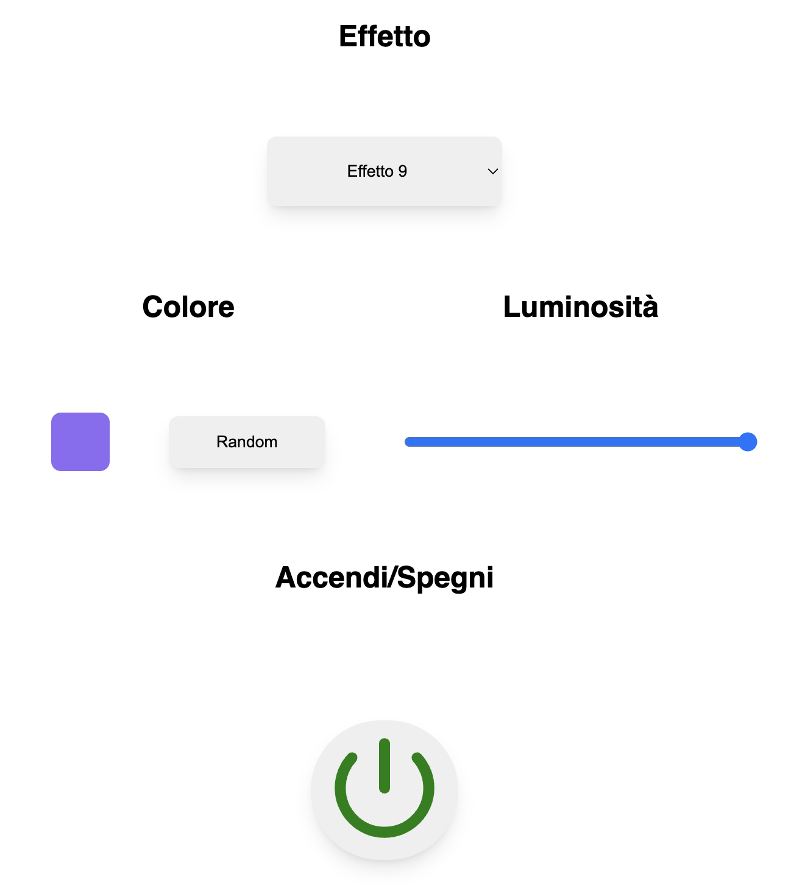

An ESP8266-based Christmas lights project using Neopixel.

A WS2812B LEDs strip gets controlled by a WiFi-connected Espressif ESP8266 using a simple web interface.
The web interface gets directly served by the microcontroller itself at the endpoint `/index` but it can be configured to be served by an external service (Glitch, GitHub, Netlify, ...) if the ESP8266's port gets exposed outside the LAN (thing I didn't have the necessity to do).

## The Web UI

A screenshot of the Web UI is visible here (may change in the future):



The UI is in Italian but can be easily translated in English or any other language:
- "Effetto" is the effect section. Here one of the included effects can be chosen or "Tutti" that changes the effect every N second (I set 30 seconds).
- "Colore" to set a specific color for the effects requiring it (some use a rainbow so the color makes no difference for them) or a Random one that will change every time the effect changes
- "Luminosità" to set the brightness
- "Accendi/Spagni" to switch on/off the whole strip

The Web UI communicates with the controller using a very simple HTTP Rest interface I have written.
The HTML file (the JS and CSS parts are directly inside it) is situated inside the `data/` directory.
Every time the Web UI is refreshed (or at the first render) it queries the ESP8266 for the current state and updates itself accordingly.

## Inspiration

Most (if not all) the effects I used come from the Neopixel, Fastled or WS2812EX libraries/examples.

# Installation

I worked using the Platformio extension from VSCode and the configuration file has been included. If you are not using Platformio, these are the third-party libraries you will need:

- [Adafruit Neopixel](https://github.com/adafruit/Adafruit_NeoPixel)
- [ESPAsyncWebServer](https://github.com/me-no-dev/ESPAsyncWebServer)
- [ArduinoJson](https://github.com/bblanchon/ArduinoJson)

In `src/` you will find the main.cpp file (where basically all code sits). All the customisable variables are in `include/main.h` and in the not included `include/credentials.h` that you have to create with the following secrets:

```
#define WIFI_SSID "Your WiFi SSID"
#define WIFI_PASSWORD "Your WiFi Password"

#define OTA_PASSWORD "password"

#define LITTLE_FS_USER "LittleFS User"
#define LITTLE_FS_PASSWORD "LittleFS Password"
```
